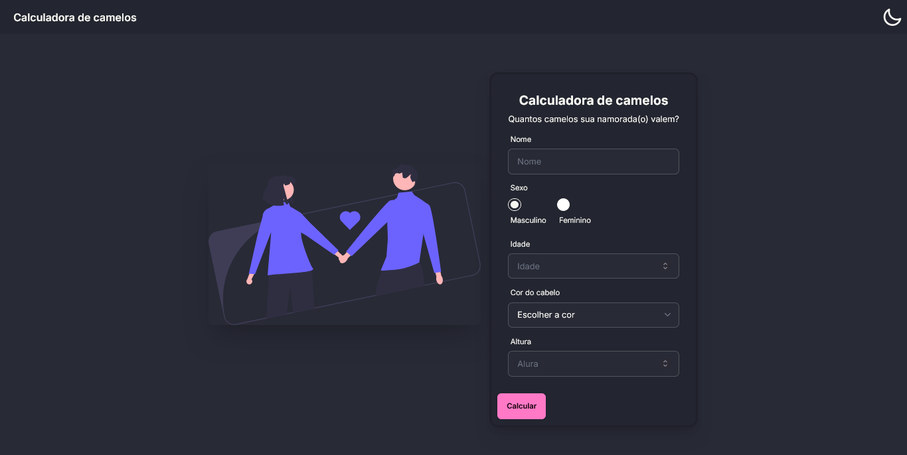

# Camels calculator 

Have you ever wondered how many camels your partner is worth?
With this application, you can.
Built in my journey into Vue.js 3 (for meme)



## Project setup
```
npm install
```

### Compiles and hot-reloads for development
```
npm run serve
```

### Compiles and minifies for production
```
npm run build
```

### Lints and fixes files
```
npm run lint
```

### Customize configuration
See [Configuration Reference](https://cli.vuejs.org/config/).
